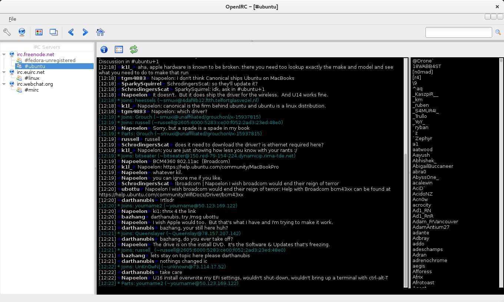
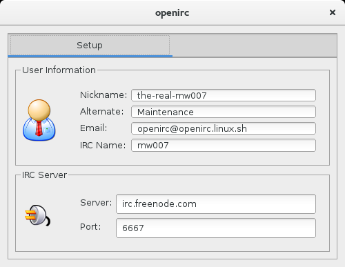

# OpenIRC

An open source IRC client built on [Qt](https://www.qt.io/).

## Build the project

The following dependencies must be satisfied before you can build the project. Use your distribution's package manager to install the following.

**Fedora, CentOS, Red Hat Enterprise Linux**
- qt-devel
- gcc-c++

Use the following commands to generate a Makefile and build the project.

~~~
$ qmake-qt4 -o Makefile openirc.pro
$ make
~~~

You will now have an executable called `openirc` in the project directory.

## Screenshots

This shows the main window, connected to multiple IRC servers.

These two show the server list and settings windows.

